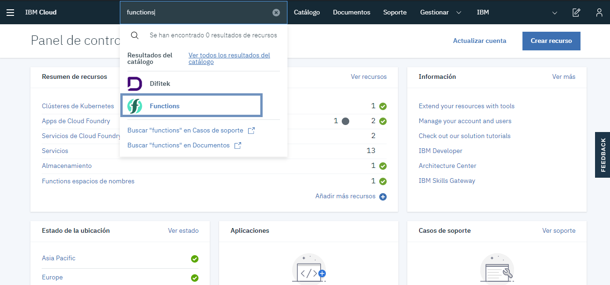
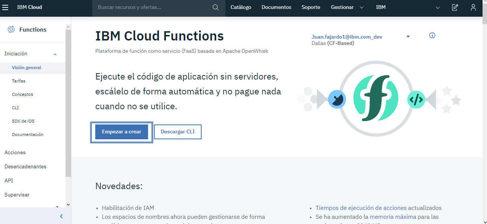
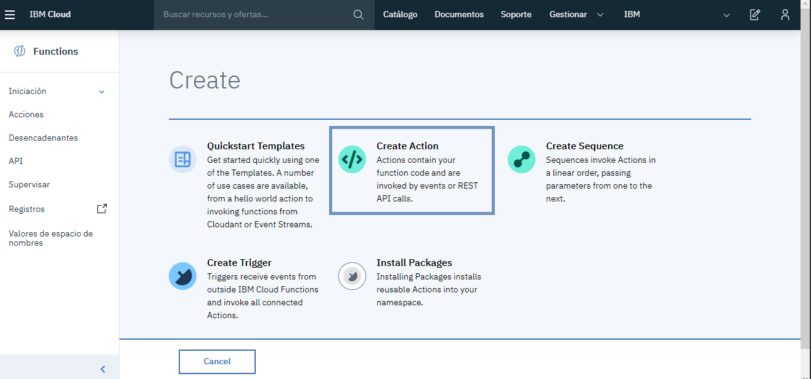
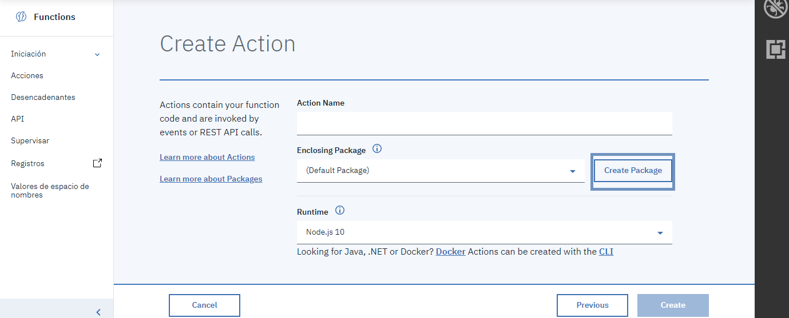
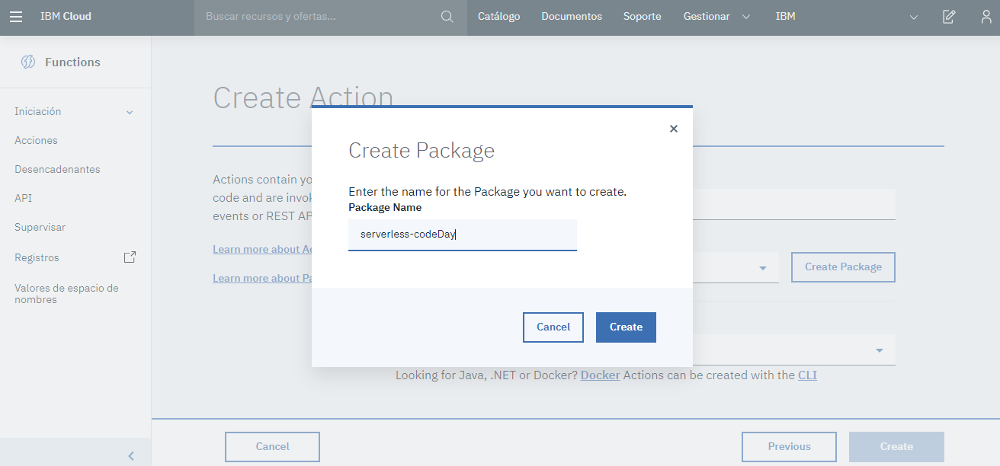
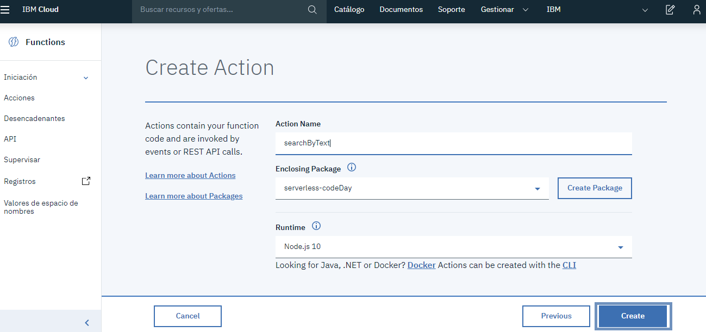
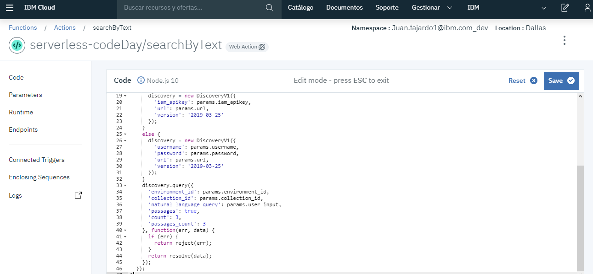
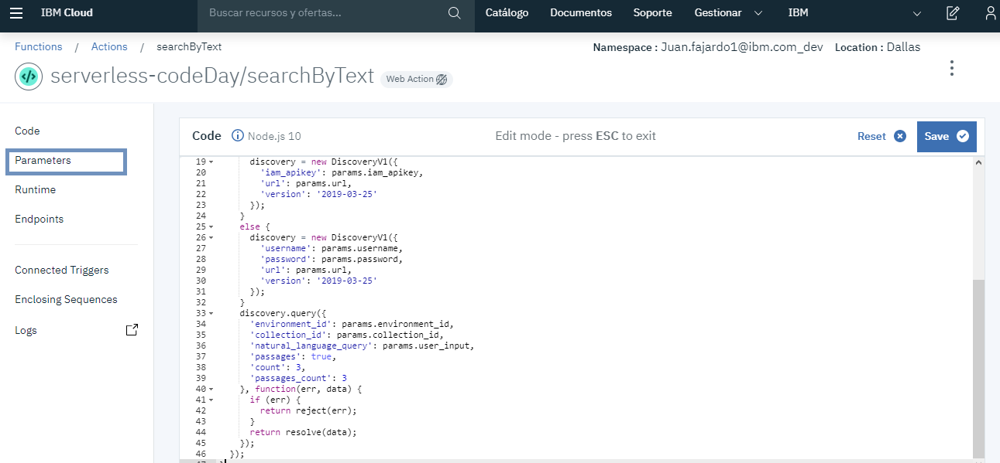
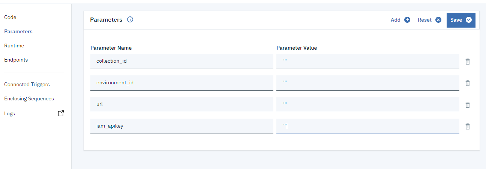
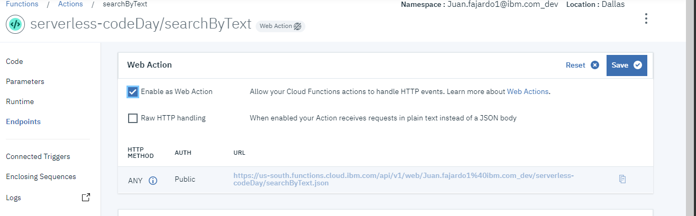

# Creando un Buscador Inteligente con Machine Learning y Serverless
### Repositorio del taller "Creando un Buscador Inteligente con Machine Learning y Serverless" del evento IBM Code Day Montevideo 2019

## Abstract:
En este taller te invitamos a crear un Buscador Cognitivo incoporando el concepto de Serverless a la arquitectura de la solución. Probaremos y aprenderemos las tecnologías de IBM Watson Discovery e IBM Cloud Functions. IBM Wa tson Discovery, uno de los buscadores más potentes en la actualidad, con la capacidad de ingestar, enriquecer y consultar información no estructurada (JSON, HTML, PDF, Word y más) gracias al poder del Machine Learning. Por su parte, IBM Cloud Functions permite a nuestras aplicaciones escalar rápidamente y de forma automática, integrarse fácilmente y optimizar los recursos utilizados reduciendo nuestros costos.


## IBM Cloud Functions

Serverless es contar con poder de computo (servidores) como utilidad, lo cual me permite  escalar  automáticamente, y donde además, pago lo que uso.

### Ingreso en IBM Cloud
* Buscamos en el catálogo Functions




* Damos click en Empezar a crear




* Create Action



# Acción N° 1 - SearchByText

Para esta primera acción, implementaremos la funcionalidad de realizar un búsqueda por texto en todos los documentos ingestados.
Primero, crearemos un paquete donde guardaremos todas nuestras acciones.

*Package Name: serverless-codeDay (opcional)*





Pondremos el nombre - searchByText



Dentro de nuestro editor de código agregamos el siguiente JavaScript

```javascript

const assert = require('assert');
const DiscoveryV1 = require('ibm-watson/discovery/v1');

/**
  *
  * main() will be run when you invoke this action
  *
  * @param Cloud Functions actions accept a single parameter, which must be a JSON object.
  *
  * @return The output of this action, which must be a JSON object.
  *
  */
function main(params) {
  return new Promise(function (resolve, reject) {

    let discovery;

    if (params.iam_apikey){
      discovery = new DiscoveryV1({
        'iam_apikey': params.iam_apikey,
        'url': params.url,
        'version': '2019-03-25'
      });
    }
    else {
      discovery = new DiscoveryV1({
        'username': params.username,
        'password': params.password,
        'url': params.url,
        'version': '2019-03-25'
      });
    }
    discovery.query({
      'environment_id': params.environment_id,
      'collection_id': params.collection_id,
      'natural_language_query': params.user_input,
      'passages': true,
      'count': 3,
      'passages_count': 3
    }, function(err, data) {
      if (err) {
        return reject(err);
      }
      return resolve(data);
    });
  });
}
```





* Set Parameters

Ahora debemos agregar los parámetros que tenemos en nuestro código los cuales obtendremos del servicio Watson Discovery. Para esto:

//OBTENER PARAMETROS DE DISCOVERY IMG

Con los parámetros, volvemos a nuestra acción y accedemos a la sección parameters




Agregaremos los parámetros que se muestran a continuación sustituyendo el *Parameter Value* por los datos obtenidos del servicio discovery



A continuación accederemos a la sección Endpoints para habilitar el acceso a neustra acción a través de HTTP. 
*Nota: el servicio de IBM Cloud Functions brinda el acceso utilizando autenticación, a efectos prácticos para este caso no utilizaremos la autenticación*



Damos click en *Save* para que el cambio se ejecute