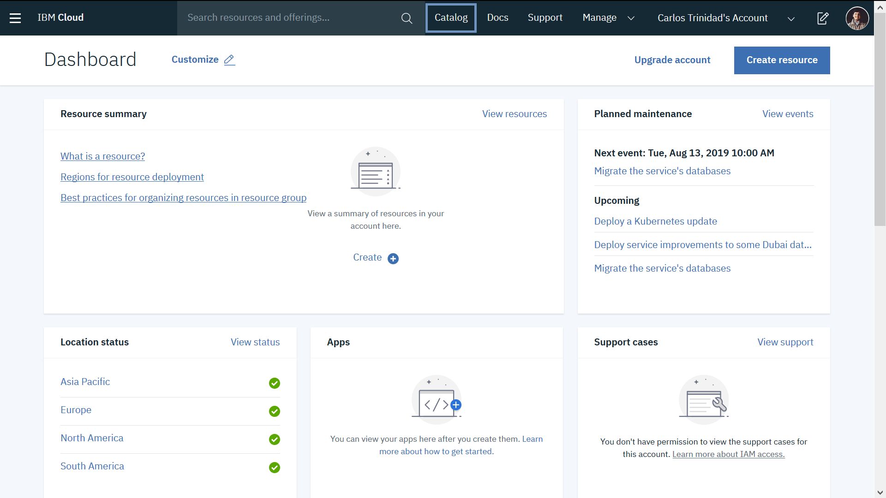
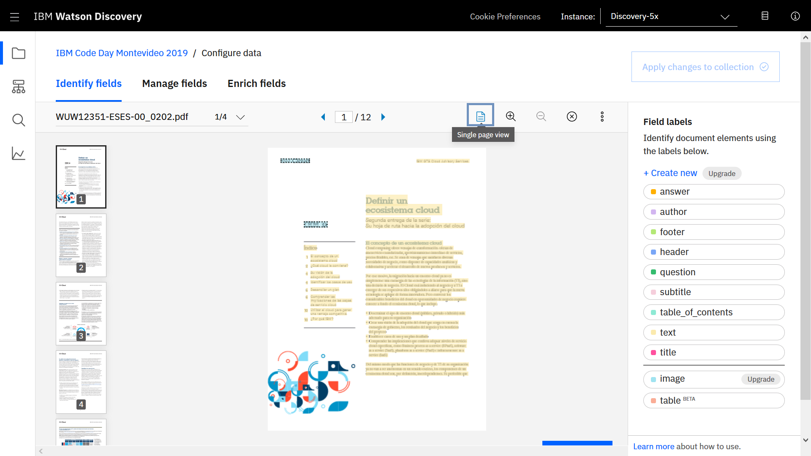
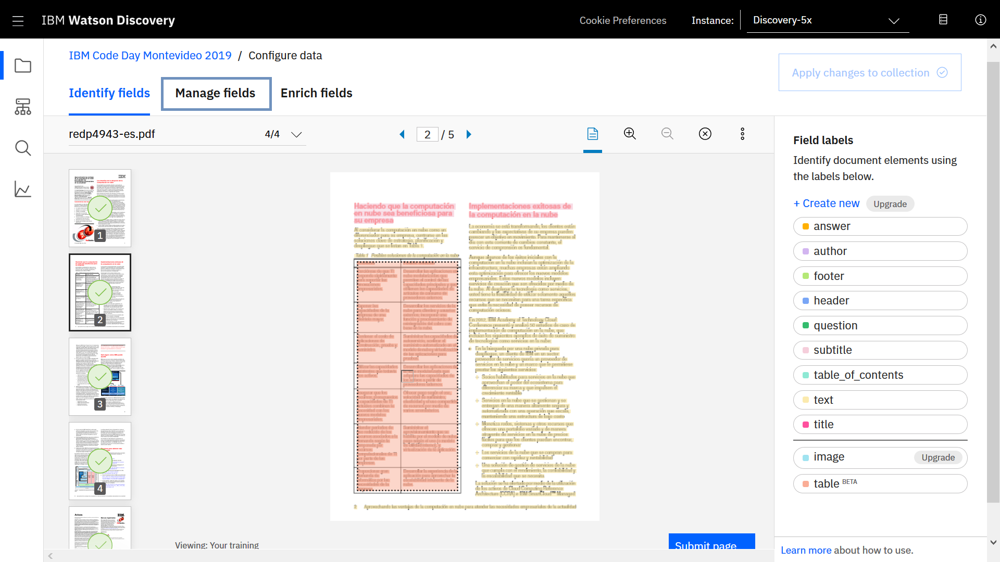
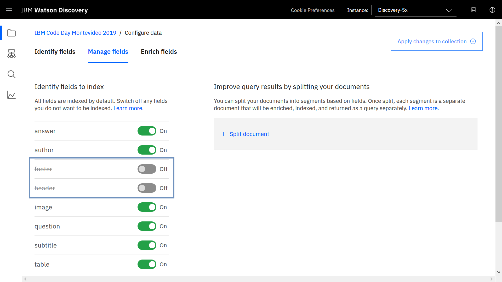
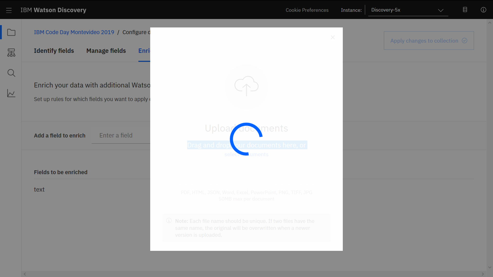
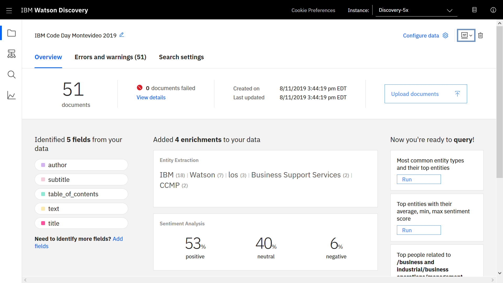

# Creando un Buscador Inteligente con Machine Learning y Serverless
### Repositorio del taller "Creando un Buscador Inteligente con Machine Learning y Serverless" del evento IBM Code Day Montevideo 2019

## Abstract:
En este taller te invitamos a crear un Buscador Cognitivo incoporando el concepto de Serverless a la arquitectura de la solución. Probaremos y aprenderemos las tecnologías de IBM Watson Discovery e IBM Cloud Functions. IBM Wa tson Discovery, uno de los buscadores más potentes en la actualidad, con la capacidad de ingestar, enriquecer y consultar información no estructurada (JSON, HTML, PDF, Word y más) gracias al poder del Machine Learning. Por su parte, IBM Cloud Functions permite a nuestras aplicaciones escalar rápidamente y de forma automática, integrarse fácilmente y optimizar los recursos utilizados reduciendo nuestros costos.


## IBM Watson Discovery

Watson Discovery es una herramienta que nos permite agregar un motor de busqueda cognitiva y de análisis de contenido a nuestras aplicaciones para identificar patrones, tendencias e información procesable en nuestros datos no estructurados.

### Ingreso en IBM Cloud
* Buscamos en el catálogo Discovery


<br />
<br />


<br />
<br />


<br />
<br />

* Dejamos las opciones predeterminadas y damos click en crear


<br />
<br />

* Una vez que el servicio este aprovisionado, en resource list damos click en su nombre para ver las caracteristicas del servicio.


<br />
<br />

* Copiamos y guardamos los valos API KEY y URL para usarlos más adelante. Luego ingresamos a la tool de Discovery.


<br />
<br />

### Tool de Watson Discovery
* Una vez aquí ya podemos comenzar a trabajar con la herramienta de Discovery y cargar nuestros datos. A continuación haremos click en "Upload your own data".


<br />
<br />

* Como es la primera vez que iniciamos un servicio de Watson Discovery nos aparecerá este mensaje. Haremos click en "Set up with current plan".


<br />
<br />

* Una vez terminado el proceso, crearemos nuestra primer colección de Discovery. Cómo nombre digitaremos "IBM Code Day Montevideo 2019" y como idioma elegimos Spanish.


<br />
<br />

### Subiendo nuestros documentos a Discovery
* Una vez creada nuestra colección comenzaremos a subir nuestros Documentos a Discovery. Para esto haremos click en "select documents" o arrastraremos y soltaremos los documentos. Los documentos de prueba que usaremos se encuentran en la carpeta (./documents) de este repositorio.


<br />
<br />


<br />
<br />

* Una vez seleccionados los documentos, estos se comenzarán a indexar en la herramienta de Discovery. Por lo cual tendremos que esperar unos segundos hasta que los cuatro documentos queden listos.


<br />
<br />

* Cuando los documentos queden listos e indexados correctamente. Podremos ver un dashboard con ejemplos de los enriquecimientos y análisis que Discovery ha detectado en el texto.


<br />
<br />

### Explorando nuestros documentos

* Ahora que indexamos nuestros documentos a Discovery, podemos probar y ver que resultados nos esta devolviendo. Para esto nos dirigiremos a la opción "Build Queries"


<br />
<br />

* Una vez aquí podemos comenzar a buscar sobre nuestros documentos, por ahora la forma más facil es ir a la opción "Search for Documents" y escribir nuestra consulta en lenguaje natural. Los documentos que indexamos tratan sobre computación en la nube, así que podemos preguntar cosas relacionadas a esa tematica.


<br />
<br />

* La consulta de ejemplo que utilice fue "Cuales son los beneficios de la computación en la nube?", una vez escrita damos click al boton "Run Query".


<br />
<br />

* Lo primero que encontraremos que nos devuelve la herramienta son los Passages. Los Passages son fragmentos de texto que Discovery extrae de los distintos documentos indexados, estos fragmentos de texto tienen una alta probabilidad de contestar directamente la consulta ingresada.


<br />
<br />

* Lo segundo que encontramos son los Results. Los Results son los son los documentos que tienen mayor probabilidad de contener la información para contestar la consulta ingresada. 


<br />
<br />

* Por ultimo tenemos una opción que nos permite visualizar el JSON de los datos. Este sería el JSON que obtendríamos en nuestra aplicación luego de hacer una llamada a la API de Discovery.


<br />
<br />

### Entrenando a Discovery con SDU

Smart Document Understanding (SDU) es una nueva forma de entrenar a IBM Watson Discovery para extraer campos personalizados en nuestros documentos. Personalizar cómo se indexan los documentos en Discovery mejorará las respuestas devueltas por nuestra aplicación.

Con SDU, podemos anotar campos dentro de los documentos para entrenar modelos de conversión personalizados. A medida que anotamos, Watson está aprendiendo y comenzará a predecir anotaciones.

* Para comenzar a entrenar a Discovery nos dirigiremos a la opción "Configure Data" de nuestro Dashboard de Discovery.


<br />
<br />

* Una vez aquí veremos como Watson Discovery ha detectado el formato de nuestros documentos y el texto que hay en el mismo. Ahora nosotros comenzaremos a "etiquetar" o "anotar" propiedades del texto, ya sean el Titulo (title), Pie de página (footer), Encabezado (header), Autor (author), Subtitulos (subtitle) y Texto normal (text).


<br />
<br />

* La forma más facil de anotar es hacer uso de la interfaz gráfica que te brinda. Primero lo mejor es hacer uso del "Single Page View"


<br />
<br />

* Ahora con esta "Vista" comenzaremos a "anotar" o "pintar" nuestro texto con las propiedades correspondientes. En este caso queda a total libertad de cada uno pintar los documentos cómo más crean que corresponda! Solo un consejo: Pinten al menos un buen par de Titulos o Subtitulos en cada documento para así la siguiente parte salgan buenos resultados. No se olviden a dar click en el botón "Submit Page" luego de haber finalizado de pintar cada pagina!


<br />
<br />

* Una vez que ya hayamos "pitado"/"anotado" varias páginas de todos nuestros documentos, procederemos a la siguiente parte de configuración de SDU: "Manage Fields"


<br />
<br />

En esta sección de "Manage Fields" tenemos dos posibilidades:

* Eliminar que propiedades indexar a Discovery.
* "Split" o "Segmentar" los documentos a través de una propiedad.

La primera nos permite elegir en base a las propiedades que conocemos ahora, cual NO indexar al momento de subir documentos nuevos a Discovery. Esto sirve por ejemplo cuando tenemos datos que no queremos devolver al usuario ya que no le aportan valor a él ni a la busqueda en sí misma.

* En este caso para el ejemplo vamos a NO indexar las propiedades "footer" y "header".


<br />
<br />

La segunda posibilidad que nos permite elegir es la opción de "split documents". Esta opción es la razón por la cual podemos mejorar nuestros resultados de Discovery gracias a SDU. 
A través de esta opción podemos seleccionar una propiedad para "segmentar" los documentos. Una vez "segmentado" cada segmento es un nuevo documento que sera enriquecido, indexado y devuelto separado tal cual cómo si fuera cualquier otro documento que le ingestamos a Discovery.

Esto es util por ejemplo cuando tenemos un gran documento de 50 páginas, lo segmentamos en base a X propiedad y luego al usuario le llega el "segmento" o documento que contiene la respuesta a su consulta.

* En este caso segmentaremos en base a Subtitulos.


<br />
<br />

Por ultimo tenemos la opción de "Enrich Fields". Esta opción nos permite agregar más propiedades de enriquecimiento de texto a cada propiedad que hemos identificado.

* Para este caso de ejemplo, lo voy a dejar default.


<br />
<br />

* Por ultimo daremos click en "Apply changes to collection". Esto hará que se aplique el nuevo modelo y configuración que hemos elegido a nuestra colección de Discovery.


<br />
<br />

* Ahora veremos que nuevamente nos pide que subamos documentos. Esto sucede ya que ahora acabamos de aplicar un nuevo modelo de Machine Learning a nuestra colección y necesitamos actualizar los documentos que ya existen indexandolos de nuevo.


<br />
<br />


<br />
<br />

Ahora los documentos comenzarán a indexarse de nuevo con la nueva configuración del modelo que creamos. Esto puede demorar unos segundos. 
Recomendamos que si no visualizan los nuevos datos en el dashboard refresquen la página.


<br />
<br />

Y listo! Ya tenemos nuestros documentos indexados con el nuevo modelo.
En mi caso se crearon 51 documentos y también tengo 51 warnings. Estas warnings fueron porque yo no entrene a mi modelo para que detectará footers, entonces como no los reconoce no los puede eliminar.


<br />
<br />


<br />
<br />

Ahora podemos volver a la pestaña de "Build Queries" y probar nuevamente nuestra consulta en lenguaje natural que habiamos hecho con antelación. 
En mi caso vemos que devuelve muchos más resultados y vemos una nueva propiedad en el JSON de resultados, el cual es la propiedad "Subtitle".


<br />
<br />

Ahora es momento de utilizar esta colección en nuestra aplicación cognitiva y en nuestras funciones serverless!

Necesitaremos guardar y copiar unas credenciales para sumarlas con las que habiamos guardado antes (API KEY y URL).

* Para esto volveremos a nuestro Dashboard de la colección y haremos click en el botón "API" justo al lado de "Configure Data".


<br />
<br />

* Una vez hecho esto, nos copiaremos y guardaremos los valores de "Environment ID" y "Collection ID", estos serán usados más adelante.


<br />
<br />


## IBM Cloud Functions

Serverless es contar con poder de computo (servidores) como utilidad, lo cual me permite  escalar  automáticamente, y donde además, pago lo que uso.

### Ingreso en IBM Cloud
* Buscamos en el catálogo Functions


<br />
<br />

* Damos click en Empezar a crear


<br />
<br />

* Create Action
<br />


<br />
# Acción N° 1 - SearchByText

Para esta primera acción, implementaremos la funcionalidad de realizar un búsqueda por texto en todos los documentos ingestados.
Primero, crearemos un paquete donde guardaremos todas nuestras acciones.

*Package Name: serverless-codeDay (opcional)*
<br />


<br />
<br />
Pondremos el nombre - searchByText
<br />


<br />
Dentro de nuestro editor de código agregamos el siguiente JavaScript

```javascript

const assert = require('assert');
const DiscoveryV1 = require('ibm-watson/discovery/v1');

/**
  *
  * main() will be run when you invoke this action
  *
  * @param Cloud Functions actions accept a single parameter, which must be a JSON object.
  *
  * @return The output of this action, which must be a JSON object.
  *
  */
function main(params) {
  return new Promise(function (resolve, reject) {

    let discovery;

    if (params.iam_apikey){
      discovery = new DiscoveryV1({
        'iam_apikey': params.iam_apikey,
        'url': params.url,
        'version': '2019-03-25'
      });
    }
    else {
      discovery = new DiscoveryV1({
        'username': params.username,
        'password': params.password,
        'url': params.url,
        'version': '2019-03-25'
      });
    }
    discovery.query({
      'environment_id': params.environment_id,
      'collection_id': params.collection_id,
      'natural_language_query': params.user_input,
      'passages': true,
      'count': 3,
      'passages_count': 3
    }, function(err, data) {
      if (err) {
        return reject(err);
      }
      return resolve(data);
    });
  });
}
```
<br />
<br />


<br />

* Set Parameters

<br />
Ahora debemos agregar los parámetros que tenemos en nuestro código los cuales obtendremos del servicio Watson Discovery. Para esto:

//OBTENER PARAMETROS DE DISCOVERY IMG
<br />
Con los parámetros, volvemos a nuestra acción y accedemos a la sección parameters
<br />


<br />
Agregaremos los parámetros que se muestran a continuación sustituyendo el *Parameter Value* por los datos obtenidos del servicio discovery
<br />


<br />
A continuación accederemos a la sección Endpoints para habilitar el acceso a neustra acción a través de HTTP. 
<br />
*Nota: el servicio de IBM Cloud Functions brinda el acceso utilizando autenticación, a efectos prácticos para este caso no utilizaremos la autenticación*


Damos click en *Save* para que el cambio se ejecute
Realizado esto, accediendo a la sección Acciones deberíamos tener nuestro *package* con la acción creada


<br />

# Acción N° 2 - NewsTopStories

Para crear nuestra nueva acción daremos click en Create en la sección Acciones


<br />
Pondremos el nombre - news-discovery y guardaremos la función en el paquete creado anteriormente
<br />

```javascript
const assert = require('assert');
const DiscoveryV1 = require('ibm-watson/discovery/v1');

/**
  *
  * main() will be run when you invoke this action
  *
  * @param Cloud Functions actions accept a single parameter, which must be a JSON object.
  *
  * @return The output of this action, which must be a JSON object.
  *
  */
function main(params) {
  return new Promise(function (resolve, reject) {

    let discovery;

    if (params.iam_apikey){
      discovery = new DiscoveryV1({
        'iam_apikey': params.iam_apikey,
        'url': params.url,
        'version': '2019-03-25'
      });
    }
    else {
      discovery = new DiscoveryV1({
        'username': params.username,
        'password': params.password,
        'url': params.url,
        'version': '2019-03-25'
      });
    }

    discovery.query({
      'environment_id': params.environment_id,
      'collection_id': params.collection_id,
      'natural_language_query': params.user_input,
      'deduplicate': true
    }, function(err, data) {
      if (err) {
        return reject(err);
      }
      return resolve(data);
    });
  });
}
```

<br />

Agregaremos los parámetros que se muestran a continuación sustituyendo el *Parameter Value* por los datos obtenidos del servicio discovery

<br />

*Nota: para el caso del collection_id, nótese que utilizamos news-en. Esta colección nos brinda la posibilidad de buscar en un dominio de noticias en inglés. Se utiliza este debido a que es el más acutalizado (aproximadamente 300.000 noticias diarias). Para buscar en español debemos modificar el value a news-es*


<br />

A continuación accederemos a la sección Endpoints para habilitar el acceso a neustra acción a través de HTTP. 

<br />

Damos click en *Save* para que el cambio se ejecute

# Acción N° 3 - SentimentAnalysis

Para crear nuestra nueva acción daremos click en Create en la sección Acciones


<br />
Pondremos el nombre - sentimentAnalysis y guardaremos la función en el paquete creado anteriormente
<br />

<br />

*Nota: Nótese que la acción que creamos es similar a las anteriores pero agregamos modificamos la respuesta del servicio de discovery*

```javascript
const assert = require('assert');
const DiscoveryV1 = require('ibm-watson/discovery/v1');

function main(params) {
    return new Promise(function (resolve, reject) {

        let discovery;

        if (params.iam_apikey) {
            discovery = new DiscoveryV1({
                'iam_apikey': params.iam_apikey,
                'url': params.url,
                'version': '2019-03-25'
            });
        }
        else {
            discovery = new DiscoveryV1({
                'username': params.username,
                'password': params.password,
                'url': params.url,
                'version': '2019-03-25'
            });
        }

        discovery.query({
            'environment_id': params.environment_id,
            'collection_id': params.collection_id,
            'natural_language_query': params.user_input,
            deduplicate: true,
            aggregation: 'term(enriched_text.sentiment.document.label,count:10)'
        }, function (err, data) {
            if (err) {
                return reject(err);
            }
            return resolve(data);

        });
    })
}

```

<br />

Agregaremos los mismos parámetros que incorporamos anteriormente

<br />


<br />

A continuación accederemos a la sección Endpoints para habilitar el acceso a neustra acción a través de HTTP. 

<br />

Damos click en *Save* para que el cambio se ejecute


#Deploy a IBM Cloud de nuestra app

En este paso, realizaremos el deploy de nuestra aplicacion a IBM Cloud como una cloud foundry.
Para realizar esto, editaremos en primer lugar el archivo manifest.yml que aparece en el repo que clonamos anteriormente.
Debemos modificar la línea name que aparece en el .yml por un nombre unico que elijamos
<br />

```yml
---
  applications:
  - name: my_nombre_unico
    random-route: true
    memory: 128M
    buildpack: https://github.com/cloudfoundry/staticfile-buildpack
```

<br />

Con esto pronto, desde línea de comandos, posicionados en el directorio donde clonamos el repositorio, ejecutamos los siguientes comandos:

```bash

ibmcloud login #Si es un usuario federado (@..ibm.com) usar ibmcloud login --sso
ibmcloud cf push

```
<br />

Cuando finalice el proceso de deploy deberíamos tener acceso a nuestra aplicación en una url similar a la siguiente:

[http://my_nombre_unico-grouchy-crocodile.mybluemix.net](http://my_nombre_unico-grouchy-crocodile.mybluemix.net)